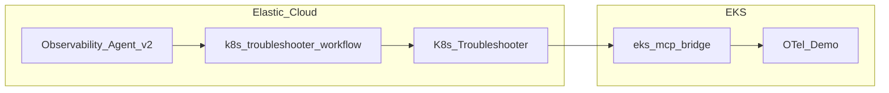

This guide shows how to keep a parent **Elasticsearch Observability AI Agent** focused on traces, logs, and service graphs for triaging application issues (opentelemetry-demo application in this case), running in AWS EKS, while you delegate live **Amazon EKS** inspection to a second agent that only exposes **EKS MCP** tools.
You wire the handoff with **Kibana Workflows** and Agent Builder **`converse`** API, then validate the setup by breaking **`product-catalog`** `targetPort` and running two prompts.
Platform engineers and SREs who already run Elasticsearch for Observability get a repeatable pattern for safer, reviewable cluster access without overloading one agent with every tool.

## Problem context

Outages often show up as correlated errors on multiple services like **checkout**, **frontend**, and **recommendation** in Elasticsearch.
That pattern can mean a shared dependency, or it can mean Kubernetes is misleading callers: wrong **`targetPort`**, empty **Endpoints**, or pods that never become ready.
Elasticsearch tells you *that* callers fail and *which* edges look wrong.
It does not fetch the live **Service** spec or compare **`containerPort`** to **`targetPort`** for you.

The **Observability** stock agent in Agent Builder is built for APM, logs, metrics, dependencies, and service maps.
It is not a full EKS operations console.
You could attach all **EKS MCP** tools to the same agent, but long tool lists increase wrong-tool calls, slow planning, and blast radius if a prompt accidentally asks for mutating actions.

## Solution overview

Use **Observability Agent v2** (a duplicate of the stock agent) as the only agent your SRE chats with.
It reasons from Elasticsearch first.
When evidence points to cluster config, it calls a **workflow** tool that invokes **`K8s Troubleshooter`** agent over **`/api/agent_builder/converse`** with a structured **`user_prompt`**.
**K8s Troubleshooter** carries only the EKS MCP tools.
Cluster access stays scoped to one specialist identity, IAM, and RBAC you can audit like any other integration.

Elasticsearch reaches EKS through an in-cluster **bridge** ([**aws-eks-mcp-setup**](https://github.com/ramp-km/aws-eks-mcp-setup)), exposed to Kibana as an **MCP connector** with a shared secret.
Exact IAM, manifests, and connector fields stay in that README so this article stays focused on agents and Workflows.




## Before you start

You need an **EKS** cluster with `kubectl` configured.
You need **Elasticsearch** and **Kibana** with Observability data, an OTLP endpoint, and an API key for the demo.
You need **Kibana 9.3+** with **Agent Builder** and rights to create agents, MCP tools, and **Workflows**(**Technical Preview**).
Budget about **two to four hours** the first time you run these steps.

## Implementation walkthrough

### Step 1: Deploy the OpenTelemetry Demo and ship telemetry

Follow [**elastic/opentelemetry-demo**](https://github.com/elastic/opentelemetry-demo) for Kubernetes or EKS.
Configure your **Elasticsearch OTLP** endpoint and API key as that repository documents.
Confirm workloads are **Running** and note the namespace (often similar to **`otel-demo`**).
In Kibana (**APM**, **Logs**, or **Service Map**), confirm data for **checkout**, **frontend**, **recommendation**, and **product-catalog**.

**Takeaway:** If you see healthy traffic to **product-catalog**, you are ready for the failure drill.


### Step 2: Run the EKS MCP bridge, register the connector and bulk import EKS MCP tools

Complete [**aws-eks-mcp-setup**](https://github.com/ramp-km/aws-eks-mcp-setup/blob/main/README.md) end to end.
The flow you would be following is : IAM for read-only cluster access, build and push the bridge image, IRSA (IAM roles for service accounts) and **Kubernetes RBAC**, deploy the bridge with a strong **`API_ACCESS_TOKEN`**, then expose the bridge as a service, test the MCP connection and bulk import tools.

**Takeaway:** A green MCP connector proves Kibana can reach the bridge before you bulk-import tools.

**Production notes:** Restrict LoadBalancer security groups to known Elasticsearch egress, prefer **TLS** on real paths, store tokens in **Secrets**, and use **read-only** MCP modes when you only diagnose.


### Step 3: Create K8s Troubleshooter agent with EKS tools only

In Agent Builder, create an agent with agent ID : **k8s_troubleshooter**, display name : **K8s Troubleshooter**, custom instructions at [**k8s_troubleshooter_agent**](https://github.com/ramp-km/blogs/blob/main/Custom%20K8s%20Troubleshooter/k8s_troubleshooter_agent.md).
Attach **only** **EKS MCP** tools to this agent.

**Takeaway:** Chat directly with **K8s Troubleshooter** once and confirm a harmless read (for example list pods in the demo namespace).


### Step 4: Clone Observability Agent without EKS tools

Clone the bundled **Observability Agent** and name it **Observability Agent v2**, so it keeps the stock Observability system instructions and tools.
Do **not** attach EKS MCP tools to this copy.
Optionally, Append short guidance that tells the parent when to call the workflow tool (that you will setup after Step 5), including namespace, resource names, and a short list of checks such as ports, selectors, Events, and logs.

**Takeaway:** The parent **Observability Agent v2** stays an Observability-first interface for the user.


### Step 5: Create the workflow and make it a callable tool

Create a new **Kibana Workflow** by importing the workflow definition at [**k8s_troubleshooter_workflow.yaml**](https://github.com/ramp-km/blogs/blob/main/Custom%20K8s%20Troubleshooter/k8s_troubleshooter_workflow.yaml) and enable it.


Create a new tool in agent builder, of type: **Workflow**, select **k8s_troubleshooter** workflow that you created, provide a suitable tool_id: **custom.k8s_troubleshooter** and a suitable tool description: **Tool to triage and troubleshoot kubernetes related issues**


On **Observability Agent v2**, attach the workflow tool that you just created.

**Takeaway:** The parent’s tool list should show the workflow, and **K8s Troubleshooter** should still answer when invoked alone.


### Step 6: Inject the product-catalog Service misconfiguration

Save the original **`targetPort`**, then patch to a wrong value (example **9999**).

```bash
kubectl get svc -A | grep product-catalog
kubectl get svc product-catalog -n <namespace> -o yaml
```

```bash
kubectl patch svc product-catalog -n <namespace> --type='json' \
  -p='[{"op": "replace", "path": "/spec/ports/0/targetPort", "value": 9999}]'
```

```bash
kubectl rollout restart deployment/checkout deployment/recommendation deployment/frontend -n default
```

Callers still resolve **Endpoints**, but traffic lands on a port the container does not listen on, so Elasticsearch shows downstream errors on **checkout**, **frontend**, and **recommendation**.

**Takeaway:** You now have symptoms in Elasticsearch and a clear cluster-side fault.


### Step 7: Run two prompts on the parent agent

Use Agent Builder chat on **Observability Agent v2**, not on the specialist.

**Prompt 1:** *Why are failure transactions increasing for services like checkout and frontend?*

Expect Observability tooling to narrow to **product-catalog**, without yet invoking **custom.k8s_troubleshooter** tool.

**Prompt 2:** *Why is product-catalog service not servicing any requests in &lt;&lt;insert your k8s cluster name&gt;&gt;? Is there any misconfiguration in the service?*

Expect **Observability Agent v2** to call **custom.k8s_troubleshooter** tool, which invokes **K8s Troubleshooter** agent and read **Service**, **Endpoints**, and pods, compare **`targetPort`** to **`containerPort`**, and explain the mismatch with evidence.

**Takeaway:** You see Observability AI Agent-led triage and cluster-grounded confirmation in one thread.


### Step 8: Roll back

Restore **`targetPort`** from your saved YAML or patch back to **8080** for this demo.

```bash
kubectl patch svc product-catalog --type='json' \
  -p='[{"op": "replace", "path": "/spec/ports/0/targetPort", "value": 8080}]'
```

```bash
kubectl rollout restart deployment/checkout deployment/recommendation deployment/frontend -n default
```

Add **`-n <namespace>`** when the Service is not in **`default`**.
Confirm **product-catalog** and upstream services recover in Elasticsearch and in the demo UI.

## Validation and trade-offs

You validated that **Observability Agent v2** stays the main surface, that **~20** EKS tools live on one specialist **K8s Troubleshooter** agent, and that **Workflow + converse API** records a clear boundary for audits and reviews.

Trade-offs: Workflows are **Technical Preview** in this path, MCP bridges need ongoing token and network hygiene, and you should keep mutating tools off or tightly RBAC-scoped until you accept the risk.

## Conclusion and next steps

The same layout works for other runbooks: swap workflow steps, change **`agent_id`**, or add workflow inputs for **cluster** and **region** when you operate more than one EKS footprint.
Tighten RBAC before you grant write-capable MCP tools, and consider alert-driven workflow triggers once the manual path is trusted.

**Agent instructions:** The long **K8s Troubleshooter** system prompt in the original standalone article remains a useful reference; keep it in source control next to the agent and refresh both when you change runbooks.
