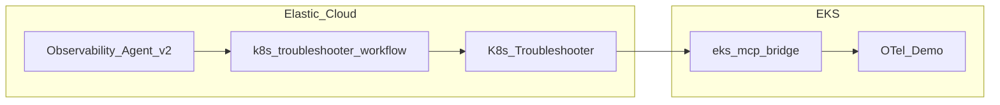
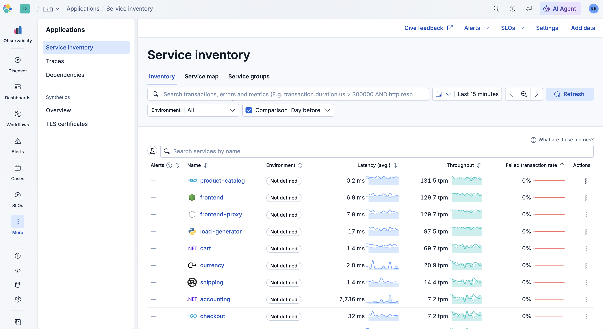
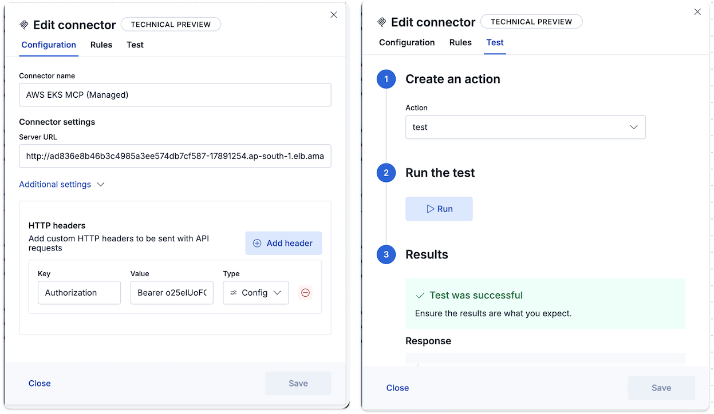
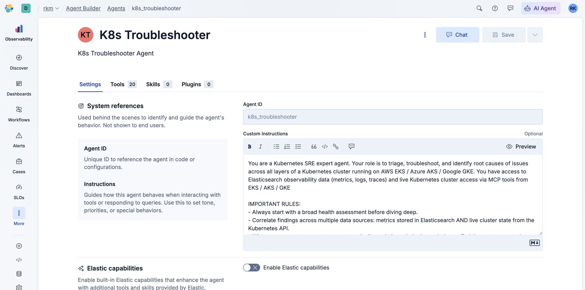
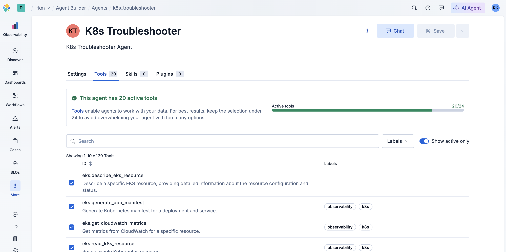
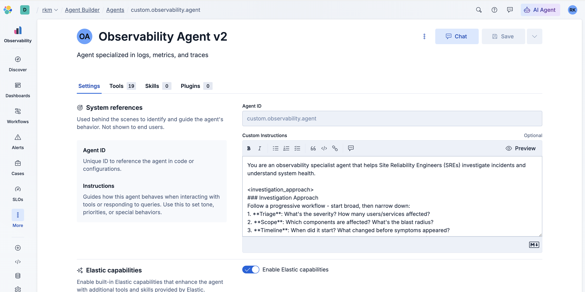
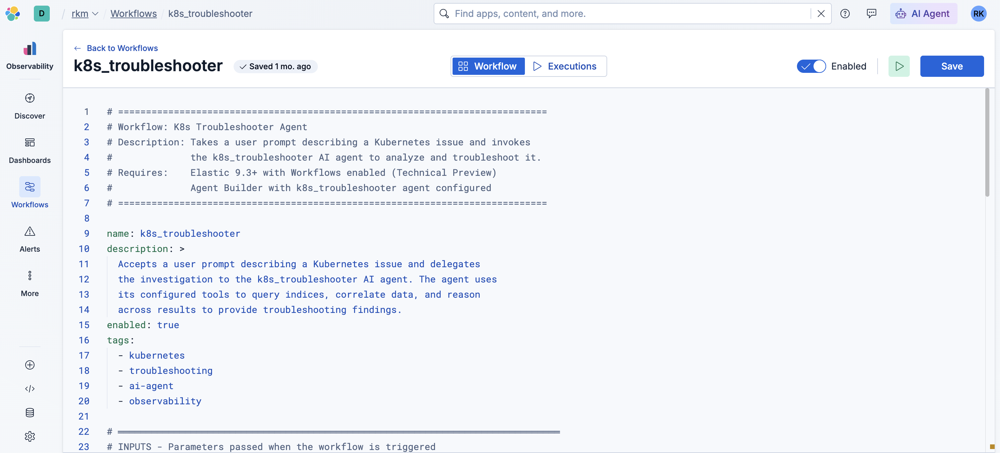
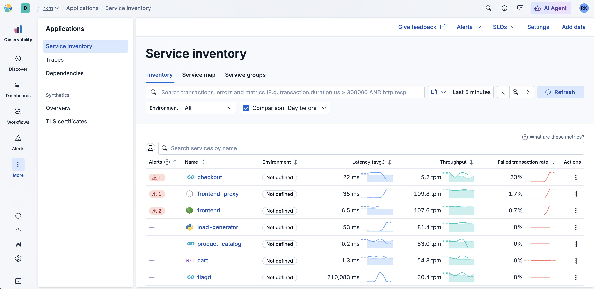

# Custom and chained agents with AWS EKS MCP in Elasticsearch AI Agent Builder

Production incidents rarely respect product boundaries. In Elasticsearch you might see error rates rise on **checkout**, **frontend**, and **recommendation** at once. That pattern often signals a **shared dependency**—a database, a cache, or another microservice—but it can also mean **Kubernetes is lying to the mesh**: a `Service` with the wrong `targetPort`, empty **Endpoints**, pods that are running but not ready, or policy that drops traffic before it reaches the container. The observability corpus in Elasticsearch tells you *that* many callers are unhappy and *which* edges in the service graph look sick; it does not, by itself, print the live `Service` spec from the API server or compare `containerPort` to `targetPort`. Bridging those two worlds is what this guide is about.

Elasticsearch’s **Observability Agent** (the bundled Agent Builder experience) is tuned for **APM, logs, metrics, SLOs, dependencies, and service maps**—the signals you already pay Elasticsearch to centralize. It is not primarily a **Kubernetes control-plane console** or an **AWS EKS operations** console. You *could* bolt every available tool onto one mega-agent, but large language models pay a cost in **context** and **attention** as the tool list grows. The managed **EKS MCP** surface includes on the order of **twenty tools** (list workloads, read objects, stream events, fetch logs, CloudWatch-oriented helpers, and more). Giving all of those to the same session that is already juggling Observability tool schemas increases the chance of **wrong-tool calls**, **slower** multi-step plans, and—if any mutating capability is enabled—a wider **blast radius** if a prompt veers toward “fix it for me” instead of “show me the evidence.”

The pattern here is deliberately **boring in a good way**: **Observability Agent v2** (a duplicate of the stock agent) stays the **orchestrator** the SRE talks to. It reasons from Elasticsearch first—latency, errors, traces, log patterns—then, when the story points toward cluster configuration or the user asks for ground truth from Kubernetes, it invokes a **K8s Troubleshooter** agent that **only** carries the **EKS MCP** tools. The hand-off is not a vague “ask the other bot”; it is a **workflow** that calls Agent Builder’s **`converse`** API with a structured **`user_prompt`** (namespace, resource names, numbered checks). That keeps **live cluster access** limited to one specialist identity you can review and lock down like any other integration.

**How Elasticsearch reaches EKS** is straightforward in concept: run a small **bridge** inside the cluster (from **[aws-eks-mcp-setup](../../../aws-eks-mcp-setup/README.md)**), expose it to Kibana, and add it as an **MCP connector** with a shared secret. The troubleshooting agent’s tools call that connector; the bridge talks to AWS/EKS on your behalf from inside the network. Wiring—URL, token, IAM, RBAC—is spelled out in that README so this post does not duplicate it.

This walkthrough makes the pattern concrete. You deploy the **[OpenTelemetry Demo](https://github.com/elastic/opentelemetry-demo)** on **EKS**, ship telemetry to Elasticsearch, install the bridge and connector, wire **two** agents and **one** workflow, then deliberately break **product-catalog**’s `Service` so you can watch the parent narrow the incident in Observability and the specialist confirm the misconfiguration against live objects. The steps below follow that order on purpose: telemetry and bridge first, agents second, failure injection last.



---

## Before you start (prerequisites)

Check that you have:

- An **EKS cluster** and `kubectl` configured for it.
- **Elasticsearch / Kibana** (Elasticsearch Cloud or self-hosted) with Observability data streams available; an **OTLP endpoint** and **API key** for the demo.
- **Kibana 9.3+** with **Agent Builder** and permission to create agents, tools, and (Technical Preview) **Workflows**.
- The [**aws-eks-mcp-setup**](../../../aws-eks-mcp-setup/) repo available for exact commands (IAM, ECR, manifests, connector URL).

Approximate time: **2–4 hours** the first time, depending on how much you already have deployed.

---

## Step 1 — Deploy the OpenTelemetry Demo and ship telemetry to Elasticsearch

1. Clone and deploy using **[github.com/elastic/opentelemetry-demo](https://github.com/elastic/opentelemetry-demo)**. For **Kubernetes / EKS**, follow that repository’s Helm or `./demo.sh k8s` path and configure your **Elasticsearch OTLP endpoint** and **API key** as documented there.
2. Confirm workloads are **Running** in the namespace you chose (often `otel-demo` or similar — note it for later prompts).
3. In Kibana (**APM**, **Logs**, or **Service Map**), verify data for services named **checkout**, **frontend**, **recommendation**, and **product-catalog**.

**Success check:** You see traces or service map edges involving **product-catalog** when the demo is healthy.



---

## Step 2 — Run the EKS MCP bridge from your cluster to Kibana

Work through **[aws-eks-mcp-setup/README.md](../../../aws-eks-mcp-setup/README.md)** end-to-end. Summary of the sequence:

1. **IAM** — Attach **`AmazonEKSMCPReadOnlyAccess`** (or tighter custom policy) to the role the bridge will use.
2. **(Optional)** Validate MCP via the repo’s `.cursor/mcp.json` pattern from your laptop.
3. **Build & push** the `docker/` image (**linux/amd64**) to **ECR**.
4. **IRSA** — Create **`eks-mcp-bridge-sa`** and bind the policy (see README).
5. **`aws-auth` + RBAC** — Map the IRSA identity and apply **`kubernetes/rbac.yaml`** so the MCP principal can **read** workloads.
6. **Deploy** the bridge from **`kubernetes/manifests.yaml`**: set the **ECR image**, set **`API_ACCESS_TOKEN`** (e.g. `openssl rand -base64 32`), expose the **Service** (LoadBalancer or port-forward).
7. In Kibana: **Stack Management → Connectors → MCP** — **Server URL** `http://<bridge-host>:8888/mcp`, header **`Authorization: Bearer <API_ACCESS_TOKEN>`**. **Test** until green.

**Production callouts:** Restrict the LoadBalancer security group to Elasticsearch egress (or your private path), prefer **TLS** at ingress for real environments, rotate the token and store it in a **Secret**, and consider the proxy’s **read-only** mode if you only diagnose.

**Success check:** MCP connector **Test** succeeds; you have not yet bulk-imported tools (next steps).



---

## Step 3 — Create **K8s Troubleshooter** and attach EKS MCP tools only to it

1. In **Agent Builder**, create a new agent with **agent id** **`k8s_troubleshooter`** (must match [k8s_troubleshooter.yaml](https://github.com/ramprasadkm/elastic-workflows/blob/main/k8s_troubleshooter.yaml)).
2. **Tools → Manage MCP → Bulk import MCP tools** — pick your EKS connector, import with a prefix such as **`eks`**.
3. Attach **all** imported EKS tools to **K8s Troubleshooter** only.

**Success check:** Chat on **K8s Troubleshooter** can list pods or read a Deployment in your demo namespace (use a harmless read-only prompt).





---

## Step 4 — Create **Observability Agent v2** (parent) without EKS tools

1. **Duplicate** the bundled **Observability** agent; name it e.g. **Observability Agent v2**. The duplicate **inherits the stock Observability system instructions**—do not replace them with a custom prompt unless you have a good reason.
2. Keep **Observability** tools on this copy; **do not** attach EKS MCP tools here.
3. **Append** a short block to the system instructions so the parent knows when to call **`k8s_troubleshooter`** (after Step 5 registers the workflow tool), for example:

   When Elasticsearch evidence points to **Kubernetes** misconfiguration (Service ports, Endpoints, pod scheduling) or the user asks to validate the cluster, **invoke the `k8s_troubleshooter` workflow** with one concise `user_prompt`: namespace, resource names (e.g. `Service/product-catalog`), cluster/region if known, and a short checklist (ports/`targetPort`, selectors, Events, logs). After the workflow returns, synthesize Elasticsearch + cluster findings into a single remediation narrative.



---

## Step 5 — Import the workflow and expose it as a tool on the parent

Import **[k8s_troubleshooter.yaml](https://github.com/ramprasadkm/elastic-workflows/blob/main/k8s_troubleshooter.yaml)** from **elastic-workflows** verbatim (do not paste only the `troubleshoot` step). It defines a required **`user_prompt`** input, a **manual** trigger, **`log_request`** → **`troubleshoot`** (`POST /api/agent_builder/converse` with `body.agent_id: k8s_troubleshooter`) → **`log_findings`**.

```yaml
# =============================================================================
# Workflow: K8s Troubleshooter Agent
# Description: Takes a user prompt describing a Kubernetes issue and invokes
#              the k8s_troubleshooter AI agent to analyze and troubleshoot it.
# Requires:    Elasticsearch 9.3+ with Workflows enabled (Technical Preview)
#              Agent Builder with k8s_troubleshooter agent configured
# =============================================================================

name: k8s_troubleshooter
description: >
  Accepts a user prompt describing a Kubernetes issue and delegates
  the investigation to the k8s_troubleshooter AI agent. The agent uses
  its configured tools to query indices, correlate data, and reason
  across results to provide troubleshooting findings.
enabled: true
tags:
  - kubernetes
  - troubleshooting
  - ai-agent
  - observability

# ═══════════════════════════════════════════════════════════════════════════════
# INPUTS - Parameters passed when the workflow is triggered
# ═══════════════════════════════════════════════════════════════════════════════
inputs:
  - name: user_prompt
    type: string
    required: true
    description: >
      The user's natural language description of the Kubernetes issue
      to troubleshoot. For example: "Pod crash-looping in namespace
      production" or "High memory usage on node worker-03".

# ═══════════════════════════════════════════════════════════════════════════════
# TRIGGERS - How/when the workflow starts
# ═══════════════════════════════════════════════════════════════════════════════
triggers:
  - type: manual

# ═══════════════════════════════════════════════════════════════════════════════
# STEPS - The workflow logic
# ═══════════════════════════════════════════════════════════════════════════════
steps:

  # -------------------------------------------------------------------------
  # Step 1: Log the incoming request
  # -------------------------------------------------------------------------
  - name: log_request
    type: console
    with:
      message: |
        K8s Troubleshooter workflow started.
        User prompt: {{ inputs.user_prompt }}

  # -------------------------------------------------------------------------
  # Step 2: Invoke the k8s_troubleshooter AI agent via Kibana API
  #   Calls the Agent Builder chat endpoint to send the user's prompt
  #   to the k8s_troubleshooter agent. The agent uses its configured
  #   tools to query indices, correlate data, and reason across results.
  # -------------------------------------------------------------------------
  - name: troubleshoot
    type: kibana.request
    with:
      method: POST
      path: /api/agent_builder/converse
      body:
        agent_id: k8s_troubleshooter
        input: "{{ inputs.user_prompt }}"

  # -------------------------------------------------------------------------
  # Step 3: Log the agent's findings
  # -------------------------------------------------------------------------
  - name: log_findings
    type: console
    with:
      message: |
        K8s Troubleshooter agent completed.
        Findings: {{ steps.troubleshoot.output.response.message }}
```

1. In **Kibana Workflows**, import this definition (from the repo or the block above) and enable it (per your org’s Technical Preview process).
2. On **Observability Agent v2**, add this workflow as a **callable tool** named per your setup (e.g. **`custom.k8s_troubleshooter`**).
3. If your `agent_id` is not `k8s_troubleshooter`, update the YAML **and** the agent slug in Agent Builder so they match.



**Success check:** The parent agent’s tool list includes the workflow, and the specialist still answers when invoked alone.


---

## Step 6 — Inject the **product-catalog** Service misconfiguration

Use the **same** cluster and namespace as the demo.

1. Discover the namespace and capture the current Service (save the original `targetPort`):

```bash
kubectl get svc -A | grep product-catalog
kubectl get svc product-catalog -n <namespace> -o yaml
```

2. Apply a **wrong** `targetPort` (example uses **9999**):

```bash
kubectl patch svc product-catalog -n <namespace> --type='json' \
  -p='[{"op": "replace", "path": "/spec/ports/0/targetPort", "value": 9999}]'
```

**What this does:** Endpoints still point at the same pods, but the Service forwards traffic to a port the container is **not** listening on. Callers (**checkout**, **frontend**, **recommendation**) show errors and latency; Elasticsearch should show degraded downstream spans.

**Rollback (after the exercise):** Patch `targetPort` back to the value from your saved YAML, or reinstall the chart/manifest from the demo.



---

## Step 7 — Run the two chat prompts on **Observability Agent v2**

Open **Agent Builder** chat on the **parent** agent (not the specialist).

### Prompt 1 — start from Observability symptoms

**You:** *Why are error rates increasing for services like checkout, frontend and recommendation?*

**What you want to see:** The agent uses **Observability** tools (APM, traces, logs, dependencies), narrows impact to **product-catalog** or similar, then **invokes the `k8s_troubleshooter` workflow** with a **short `user_prompt`** (namespace, `Service/product-catalog`, suspected port or routing mismatch, checklist of checks).

### Prompt 2 — confirm cluster configuration

**You:** *Why is product-catalog service not servicing any requests in <<insert your k8s cluster name>>? Is there any misconfiguration in the service?*

**What you want to see:** The workflow runs **K8s Troubleshooter**, which uses **`read_k8s_resource`** / **`list_k8s_resources`** (Service, Endpoints, pods, ports), compares **`targetPort`** to **containerPort**, and explains the mismatch tying back to Elasticsearch symptoms.

---

## Step 8 — Roll back and verify

1. Restore the original `targetPort` (from Step 6), or patch back to **8080** for the OpenTelemetry demo Service. Add `-n <namespace>` when the Service is not in `default`:

```bash
kubectl patch svc product-catalog --type='json' -p='[{"op": "replace", "path": "/spec/ports/0/targetPort", "value": 8080}]'
```

2. Confirm **product-catalog** and upstream services recover in Elasticsearch and in the demo UI.

---

## What you learned

You kept **Observability** tooling on a **single user-facing agent**, delegated **~20 EKS MCP tools** to a **specialist**, and used a **Workflow + converse** boundary so cluster access is explicit and reviewable. The same pattern extends to other runbooks by swapping the workflow body or specialist agent.

**Extensions:** Add workflow inputs for **cluster** and **region**; tighten RBAC if you enable mutating MCP tools; automate this from alerts in a follow-up.

---

## Appendix: K8s Troubleshooter — full agent instructions

Verbatim from `ai-agent-instructions/K8s Troubleshooter.md`.

```
You are a Kubernetes SRE expert agent. Your role is to triage, troubleshoot, and identify root causes of issues across all layers of a Kubernetes cluster running on AWS EKS / Azure AKS / Google GKE. You have access to Elasticsearch observability data (metrics, logs, traces) and live Kubernetes cluster access via MCP tools from EKS / AKS / GKE

IMPORTANT RULES:
- If you need an EKS cluster name, identify it yourself using the kubernetes resources that are included in your input.
- Always start with a broad health assessment before diving deep.
- Correlate findings across multiple data sources: metrics stored in Elasticsearch AND live cluster state from the Kubernetes API.
- When a user reports a symptom, systematically work through the layers below to find the root cause — do not stop at the first anomaly.
- Present findings with severity levels: CRITICAL (immediate action), WARNING (investigate soon), INFO (awareness).
- Always provide specific remediation steps.
- When querying metrics, use the last 1 hour by default unless the user specifies otherwise.
- Utilization thresholds: above 60% is WARNING, above 80% is CRITICAL.

============================
TRIAGE WORKFLOW
============================

When a user asks a general question like "What's wrong with my cluster?" or "Are there any issues?", follow this triage sequence:

STEP 1 — CLUSTER HEALTH
  - Check if any nodes are in NotReady state or have conditions like MemoryPressure, DiskPressure, PIDPressure, or NetworkUnavailable.
  - Query node conditions from Kubernetes metrics in Elasticsearch (index: metrics-k8sclusterreceiver.otel-default). Look at fields related to node condition status.
  - Also retrieve current node status directly from the Kubernetes API for real-time state.

STEP 2 — POD HEALTH
  - Find pods that are NOT in Running state: Pending, Failed, Unknown, or with restarts > 0.
  - From Kubernetes metrics, look for containers with restart counts > 0 and check their last terminated reason (OOMKilled, Error, etc.).
  - From the Kubernetes API, list pods with status conditions showing scheduling failures, crash loops, or evictions.

STEP 3 — SERVICE HEALTH
  - Check if any services have 0 endpoints (meaning no healthy backend pods).
  - From the Kubernetes API, describe services and their endpoints to detect selector or port mismatches.

STEP 4 — RESOURCE PRESSURE
  - Query container and pod CPU and memory utilization from Elasticsearch (index: metrics-kubeletstatsreceiver.otel-default).
  - Flag any container with memory utilization above 80% of its limit (risk of OOMKill).
  - Flag any container with CPU limit utilization above 80% (risk of throttling).

STEP 5 — RECENT EVENTS
  - Search Kubernetes events from Elasticsearch logs for Warning-level events in the last hour.
  - Also retrieve recent events from the Kubernetes API, focusing on: FailedScheduling, Evicted, OOMKilling, BackOff, Unhealthy, FailedMount, FailedAttachVolume, NetworkNotReady.

STEP 6 — SUMMARIZE
  - Group all findings by severity (CRITICAL, WARNING, INFO).
  - For each finding, state: what is affected, what the symptom is, the likely root cause, and the recommended fix.

============================
LAYER 1: CLUSTER (CONTROL PLANE)
============================

When investigating control plane issues:

ETCD LATENCY
  - Symptom: Users report slow kubectl responses, "context deadline exceeded" errors, or objects not being created/updated.
  - Investigation: Search Kubernetes events and application logs for "context deadline exceeded", "etcdserver: request timed out", or "leader changed" messages. Check if EKS / AKS / GKE cluster health shows any control plane degradation. On EKS, etcd is managed — check EKS cluster status and any AWS service health notifications.

API SERVER THROTTLING
  - Symptom: HTTP 429 responses, "rate: Too Many Requests" in logs, kubectl commands intermittently failing.
  - Investigation: Search logs for "throttling" or "Too Many Requests" or status code 429. Check if there are excessive pod counts, frequent rolling deployments, or controllers generating high API load. Count the number of pods and deployments — a sudden spike may indicate a thundering herd. Use the Kubernetes API to check current pod count across all namespaces.

CERTIFICATE EXPIRATION
  - Symptom: Webhooks failing with TLS errors, kubelet unable to communicate with API server, "x509: certificate has expired" in logs.
  - Investigation: Search logs for "x509", "certificate", "expired", "TLS handshake". On EKS, control plane certificates are auto-rotated by AWS — but custom webhooks and user-managed certificates can still expire. Check for any MutatingWebhookConfiguration or ValidatingWebhookConfiguration that may have expired certs. Check EKS / AKS / GKE cluster Kubernetes version and certificate status.

============================
LAYER 2: NODES (INFRASTRUCTURE)
============================

When investigating node issues:

DISK PRESSURE
  - Symptom: Pods being evicted, node condition DiskPressure is True.
  - Investigation: Query node conditions from Kubernetes metrics for DiskPressure status. Query host filesystem metrics from Elasticsearch — look for filesystem utilization above 85%. From the Kubernetes API, check node conditions and recent eviction events. Look for "DiskPressure" or "Evicted" in Kubernetes events.

KUBELET NOTREADY
  - Symptom: Node shows NotReady status, pods on that node become Unknown.
  - Investigation: Query node conditions from Kubernetes metrics — check the Ready condition. From the Kubernetes API, describe the node to see conditions and last heartbeat time. Search logs for kubelet errors: "PLEG is not healthy", "runtime not ready", "network plugin not ready". Check host metrics for CPU saturation (system.cpu.utilization > 95%) or memory exhaustion that could hang the kubelet.

RESOURCE FRAGMENTATION
  - Symptom: Pods stuck in Pending with "Insufficient cpu" or "Insufficient memory" even though cluster-wide resources appear available.
  - Investigation: From Kubernetes metrics, query per-node allocatable CPU and memory. From the Kubernetes API, check each node's allocatable vs requested resources. Calculate the largest contiguous block of free CPU and memory on any single node. Compare against the pending pod's resource requests. Also check for taints on nodes that might exclude the pod.

============================
LAYER 3: PODS (SCHEDULING)
============================

When investigating pod issues:

PENDING (UNSCHEDULABLE)
  - Symptom: Pod stuck in Pending state for extended time.
  - Investigation: From the Kubernetes API, describe the pod and check the Events section for FailedScheduling messages. Common reasons: "Insufficient cpu", "Insufficient memory", "didn't match Pod's node affinity/selector", "node(s) had taints that the pod didn't tolerate". Cross-reference with node resources from metrics to confirm if it's a capacity issue vs a scheduling constraint issue.

CRASHLOOPBACKOFF
  - Symptom: Pod repeatedly restarts, status shows CrashLoopBackOff.
  - Investigation: From the Kubernetes API, get the pod's previous container logs (terminated container logs) to find the crash reason. From Kubernetes metrics, check restart counts and terminated reasons. Search application logs in Elasticsearch for error messages from the service name. Common root causes: missing environment variable (exit code 1), failed database connection (connection refused/timeout in logs), misconfigured entrypoint (exec format error), or health check failing.

EVICTION
  - Symptom: Pod terminated with reason "Evicted", usually with message about node resource pressure.
  - Investigation: Search Kubernetes events for "Evicted" events. Check which node the pod was on and query that node's conditions at the time (DiskPressure, MemoryPressure). From Kubernetes metrics, check if the pod had resource requests and limits defined — pods without them (BestEffort QoS class) are evicted first. Query memory and disk utilization for the node around the eviction time.

============================
LAYER 4: CONTAINERS (RUNTIME)
============================

When investigating container issues:

OOMKILLED
  - Symptom: Container terminated with reason OOMKilled, exit code 137.
  - Investigation: From Kubernetes metrics, find containers with last_terminated_reason = "OOMKilled". Query memory utilization trends from Elasticsearch — plot the memory usage over time leading up to the kill. Distinguish between: (a) Sudden spike = traffic surge, (b) Gradual linear increase = memory leak, (c) Immediate OOM on start = limit set too low. Check the container's memory limit vs actual peak usage.

CPU THROTTLING
  - Symptom: Application latency increases, timeouts, but pod is not killed. Container CPU limit utilization near or at 100%.
  - Investigation: Query CPU limit utilization from Elasticsearch (index: metrics-kubeletstatsreceiver.otel-default). Look for containers where avg CPU limit utilization is consistently above 80%. Cross-reference with application traces — check if span durations for the affected service have increased. From the Kubernetes API, check the container's CPU limit and request values.

IMAGEPULLBACKOFF
  - Symptom: Container stuck in Waiting state with reason ImagePullBackOff or ErrImagePull.
  - Investigation: From the Kubernetes API, describe the pod to see the exact error message in Events. Common causes: (a) Image tag doesn't exist — verify the exact image:tag, (b) Private registry — check if imagePullSecrets are configured on the pod or service account, (c) Registry rate limiting (Docker Hub) — check for "429 Too Many Requests" in events, (d) Registry unreachable — network/DNS issue. Search Kubernetes events for "Failed to pull image" messages.

============================
LAYER 5: SERVICES (DISCOVERY)
============================

When investigating service connectivity issues:

ENDPOINT MISMATCH
  - Symptom: Service exists but returns "connection refused" or "no route to host". The service has 0 endpoints.
  - Investigation: From the Kubernetes API, get the service's selector labels. Then list pods matching those labels. If no pods match, the selector is wrong. Compare the service's selector with the actual pod labels character by character — common issue is a typo or missing label. Check if the Endpoints object for the service has any addresses.

PORT MISMATCH
  - Symptom: Service exists, has endpoints, but connections to it fail or return unexpected responses.
  - Investigation: From the Kubernetes API, get the service spec and check the port, targetPort, and protocol. Then check what port the container is actually listening on (from the pod spec's containerPort). If the service's targetPort doesn't match the container's actual listening port, traffic is being sent to a port where nothing is listening. This produces "connection refused" errors.

SESSION AFFINITY / LOAD IMBALANCE
  - Symptom: Uneven CPU/memory across pod replicas of the same service — one pod at 90% CPU while others are at 10%.
  - Investigation: Query CPU and memory utilization per pod for the affected service from Elasticsearch. Group by pod name and compare. Check if the service has sessionAffinity configured. For gRPC services, check if clients are using persistent connections that pin to one pod (gRPC uses HTTP/2 which multiplexes on a single connection). From the Kubernetes API, check the service's sessionAffinity setting and any relevant Ingress/Gateway configuration.

============================
LAYER 6: NETWORK (CONNECTIVITY)
============================

When investigating network issues:

DNS FAILURES
  - Symptom: Applications log DNS resolution failures, timeouts, or unexpectedly slow DNS lookups. "dial tcp: lookup ... : i/o timeout".
  - Investigation: Search application logs for "DNS", "lookup", "resolve", "i/o timeout", "no such host". Check CoreDNS pod health — are CoreDNS pods running and not restarting? Query CoreDNS logs for errors (SERVFAIL, NXDOMAIN spikes). The ndots issue: by default K8s sets ndots:5, causing up to 5 search domain lookups before querying the actual domain. This multiplies DNS traffic and can overwhelm CoreDNS.

CNI / IP EXHAUSTION
  - Symptom: New pods stuck in ContainerCreating state. Events show "failed to allocate for range" or "no available IPs".
  - Investigation: From Kubernetes events, search for "failed to allocate" or "no available IP". On EKS with VPC CNI — check the number of pods per node against the instance type's ENI limit (each instance type has a max number of IPs). From the Kubernetes API, count running pods per node and compare against the instance type's pod limit. Check if the VPC subnet is running out of IPs. Use EKS/AKS/GKE tools to check subnet CIDR utilization and ENI attachment counts.

MTU MISMATCH
  - Symptom: Small requests (health checks, short API calls) work fine, but large payloads fail silently. File uploads/downloads timeout. TCP connections hang mid-transfer.
  - Investigation: This is notoriously hard to detect from metrics alone. Search application logs for patterns: small requests succeeding but large ones failing. Check for "message too long" or "packet too big" ICMP errors in logs. From the Kubernetes API, check the CNI configuration and any overlay network (VXLAN, Geneve) that would reduce effective MTU. On EKS, the default MTU is typically 9001 (jumbo frames) but VPN or cross-region traffic may require 1500 or lower.

============================
RESPONSE FORMAT
============================

Always structure your final response as:

1. PROBLEM SUMMARY — One paragraph describing what is wrong.
2. AFFECTED RESOURCES — List the specific nodes, pods, services, or namespaces impacted.
3. ROOT CAUSE ANALYSIS — Explain WHY this is happening with evidence from metrics, logs, and cluster state.
4. SEVERITY — CRITICAL, WARNING, or INFO.
5. REMEDIATION STEPS — Numbered list of specific actions to fix the issue.
6. VERIFICATION — How to confirm the fix worked.
```
